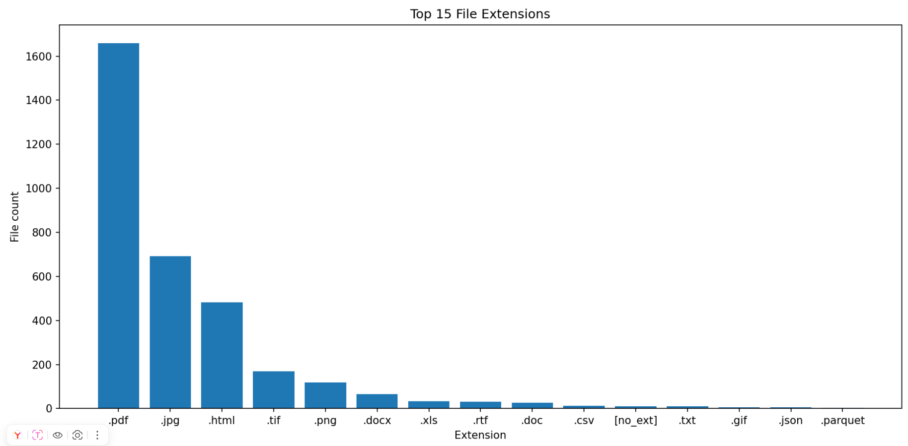

# Автоматическое обнаружение персональных данных

## Запуск программы
1. Установка зависимостей:
```bash
   pip install -r requirements.txt
```

2. Запуск кода:
```bash
    python pdprocess.py
```
Результаты будут сохранены в директорию ./results_local в формате CSV.

## Техническая реализация
### Структура кода
- Класс **PDExtractor** извлекает текст из файлов с различным форматом.

- Класс **PDSearcher** предназначен для поиска персональных данных в предоставленном тексте,  использует регулярные выражения и алгоритмы для проверки.

- Класс **PDProcess** — основной класс, реализующий поиск данных с вызовом методов классов PDExtractor и PDSearcher.

### Поддерживаемые форматы файлов
- Документы (pdf, txt, html);
- Табличные данные (csv, parquet).

### Поиск персональных данных
Используются регулярные выражения для нахождени кандидатов ПДн:
- Паспорт,
- СНИЛС,
- ИНН,
- email,
- Номер банковской карты,
- Телефон,
- ФИО.

Реализованы алгоритмы для проверки найденных ПДн:
- Алгоритм Луна;
- Проверка ИНН;
- Проверка СНИЛС.

### Определение уровня защищенности
Реализовано определение УЗ-3 и УЗ-4, более высокие уровни не определяются отдельно из-за отсутствия реализации поиска биометрии.

## Ход работы
1. **Анализ датасета**



Датасет содержит большое количество pdf-файлов, однако их использование в решении не показало хорошего результата. Реализовано частичное чтение файлов для уменьшения нагрузки на память.

2. **Исследование работы OCR.** 
Было выявлено, что наибольшее значение имеют фотографии с данными паспортов. Для их обработки была проанализирована работа различных OCR — tesseract и EasyOCR, но данные решения не показали хорошего результата. Для обработки изображений предлагается использование PaddleOCR.

3. **Использование распределенных вычислений.**
Решение базируется на pyspark.

## Дальнейшие улучшения
- Улучшение нахождения персональных данных с добавлением поиска контекста, использованием LLM.
- Использование PaddleOCR для качественного нахождения текста на изображениях, использование YOLO8 для нахождения фотографий документов.
- Поиск связей между таблицами, из которых можно извлечь составные персональные данные.